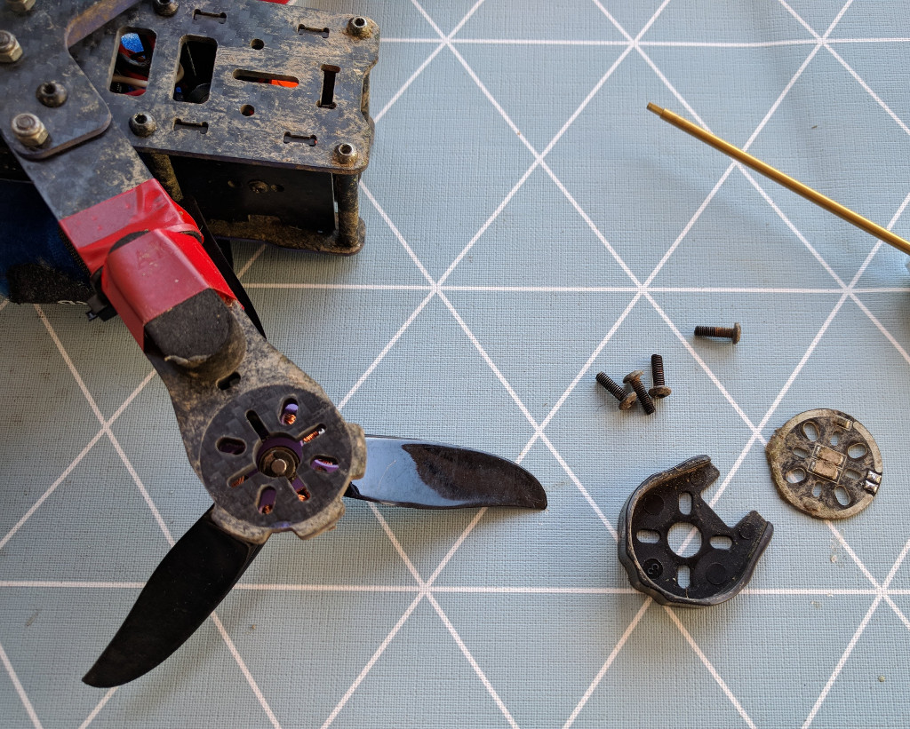
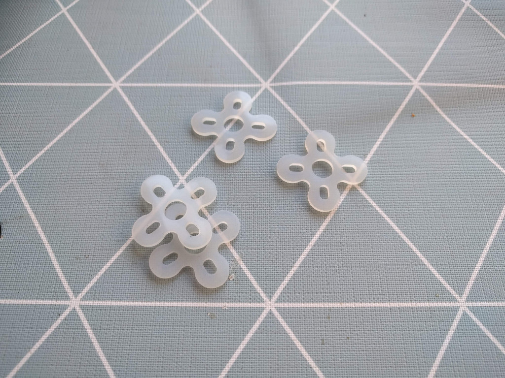
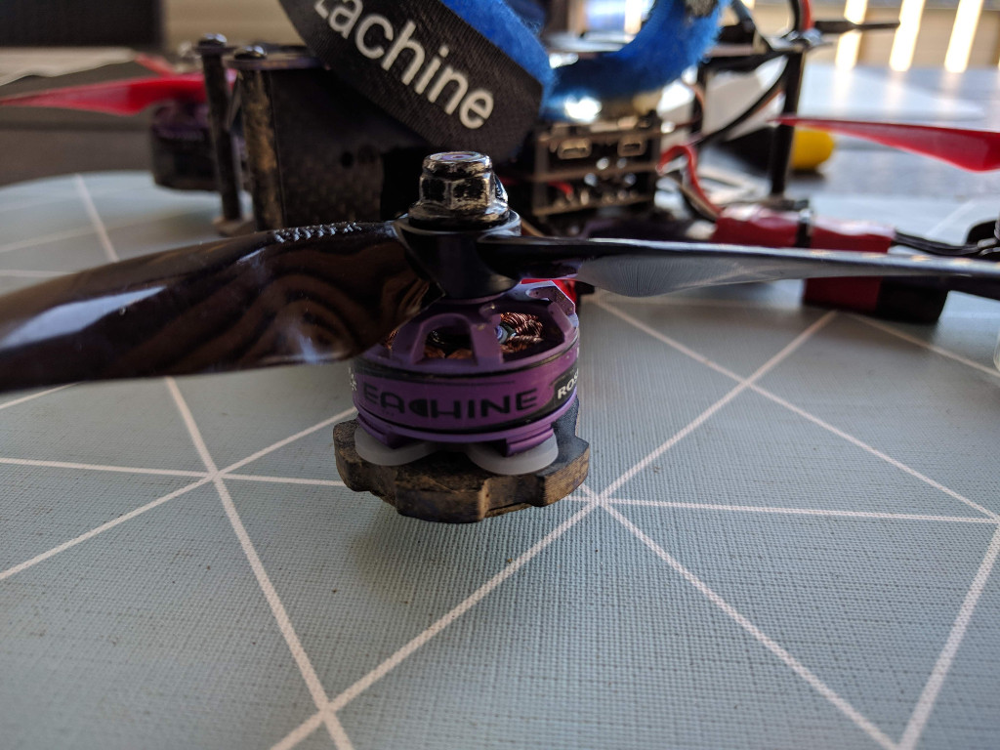
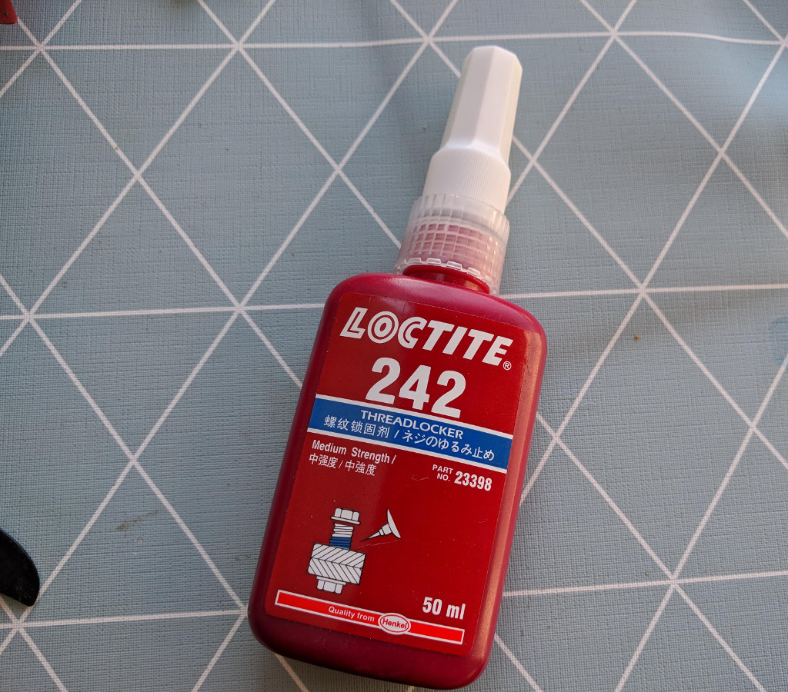
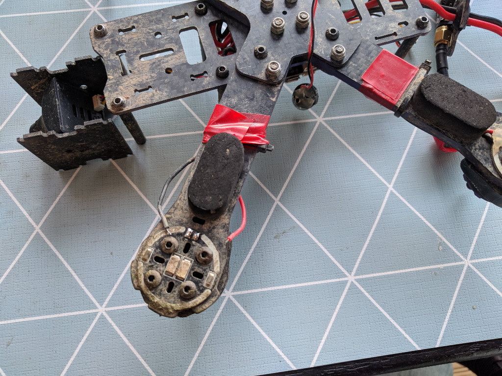
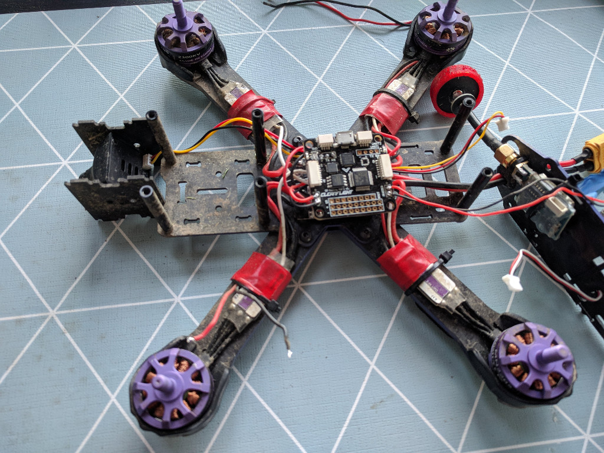
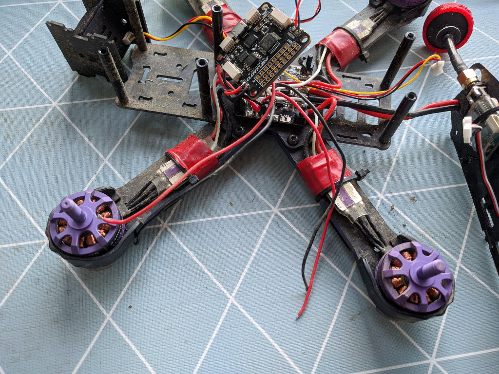

Over time I have done a number of upgrades to my [Wizard x220][2]. So many in fact, it's nowadays more of a custom build than a wizard and that's half the fun.
Here's a few upgrades regarding soft mounting motors, thread locking the motor screws, removing motor guards and leds.

- [Remove motor guards](#remove-motor-guards)
- [Soft mount motors](#soft-mount-motors)
- [Thread lock the motor screws](#thread-lock)
- [BONUS: remove leds](#remove-leds)

### Let's do this!

#### Remove motor guards

There's not a whole lot to removing the motor guards. Just undo the 4 screws under the motor, lift up the motor and slide out the motor guards to the side. Do that for all 4 motors. While we are doing this, let's do the other 3-4 tasks before we put the motors back on.

#### Soft mount the motors

I'm using [these silicone motor pads][1] to do the soft mounting. Again this is rather straightforward - just position the pad between the frame and the motor, align it and screw it in place.

Here's how it looks mounted.

But while you are here, you might as well...

#### Thread lock your motor screws

Get your hands on some thread locker, for example this one.

Apply a little of it to each screw before screwing it in place. That's all :)

One bonus item you might want to consider before you put your screws in place is to:

#### Remove the leds

One other item requiring a bit more work is to remove the leds. There could be multiple reasons to want to do that, but this is in most cases not something necessary. I for one have no need of the leds, it reduces the wire clutter drastically under the flight controller (-8 wires), frees some pads on the power distribution board (PDB). Here's how to do it.

- desolder wires from the leds from under the motor

- pull them carefully through the whole from the top of the frame arm

- desolder the wires from the PDB

Alternatively you can use wire cutter to carefully cut the wire at the base without having to desolder it. Do that for all 4 motors

And that's all of it, put your quad back together and enjoy the upgrades! Happy flying!

  <iframe width="560" height="315" src="https://www.youtube.com/embed/wZchH_Ccly8?rel=0" frameborder="0" allowfullscreen></iframe>

[0]: Linkslist
[1]: http://bit.ly/silicone-motor-pad
[2]: https://bit.ly/eachine-wizardx220
