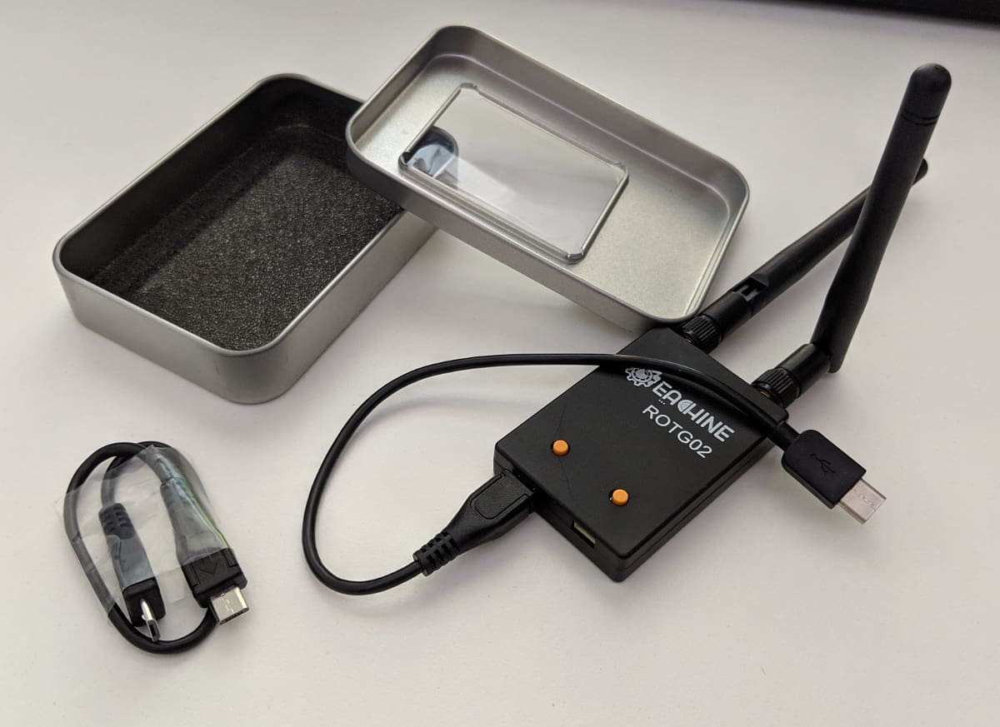
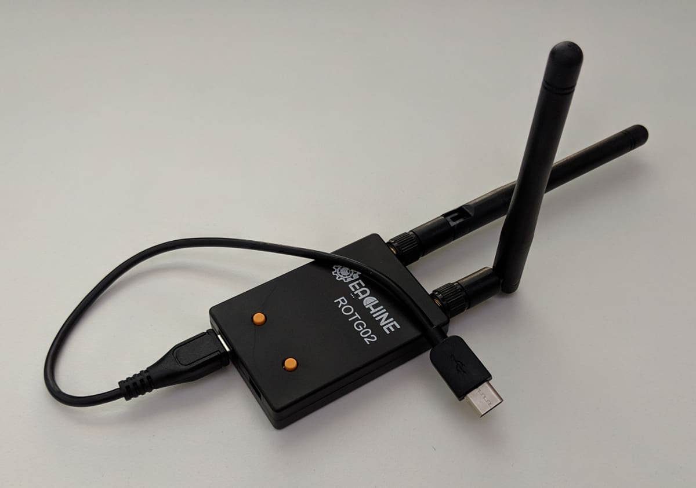
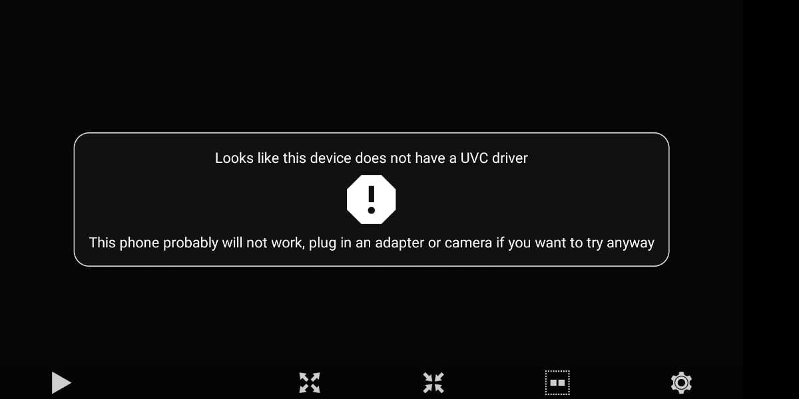
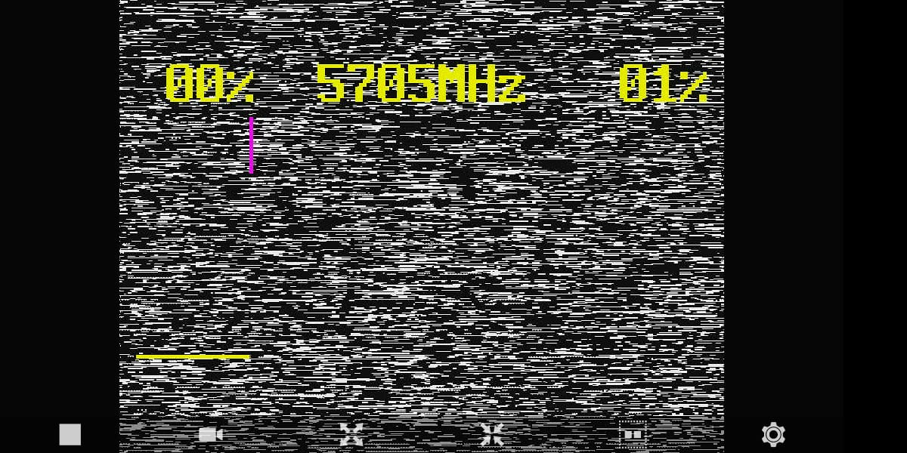
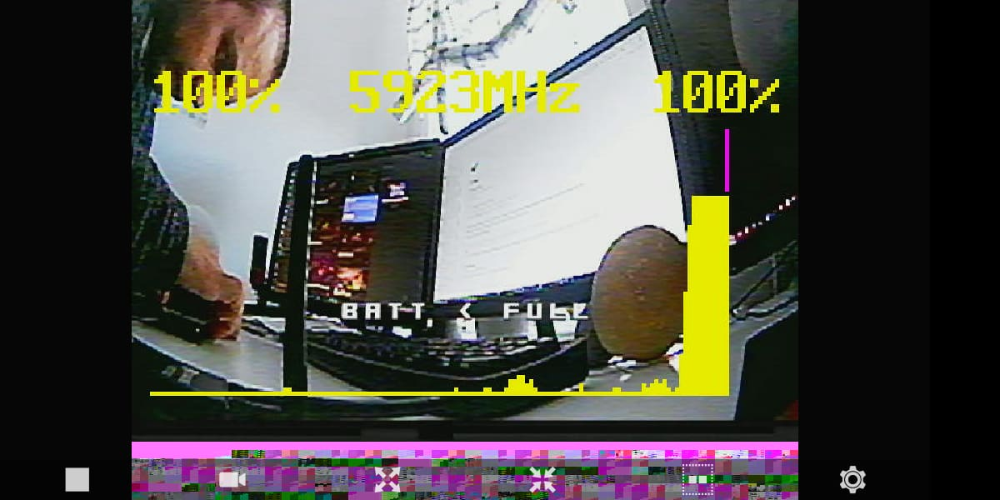
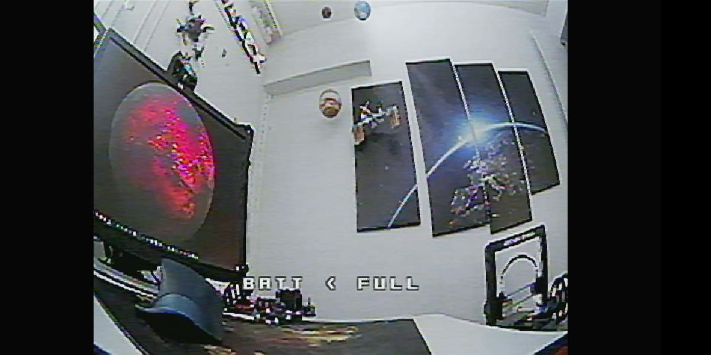

Ever since I lost my quad once and had to search for it for roughly 40 minutes and luckily I found it in the end, I've always appreciated DVR.
Now, there are many strategies to finding a lost model, including having a buzzer on board, having a separate buzzer with its own battery, maybe even having a GPS tag of sorts. I'm not going to debate what the best strategy is in this article, but I do want to share with you a bit about using DVR to find your quad.

You see in my case, I crashed into an open field and there were no notable landmarks to base my search off of. I had a rough general idea of where I crashed luckily but even that wasn't enough. Coincidently that was also soon after I got my [Aomway Commander][3] fpv goggles and was recording DVR of every flight at the time. So, I just went into the DVR, played it and found my quad within the next minute. Super awesome!

Since then I have used DVR to find my quad a few more times and it has always been very useful. Unfortunately for me, I busted my DVR button on my goggles (which is repairable but that's a topic for another time) and now I needed another way to record DVR. And that brings me to my recent discovery and the star of today's show: the [Eachine ROTG02 Diversity FPV Receiver][1]. I'm linking the Android version but they have an iPhone version as well.

What I like particularly about this model is that it comes with a USB C cable which is awesome, because I'm using a [Google Pixel 3][4] phone. It is also a true diversity module with 2 antennas which you can position perpendicular to each other (at 90 deg) for maximum efficiency. The range is sweet, the module works like a charm and has a search functionality when you long press a button for a few seconds.

In terms of software, I used [Go FPV][5] which looks like this when you first start it and have nothing connected.

Don't get alarmed by the UVC driver message. When you plug in your module it goes away. A couple of time my phone prompted me to select the correct connected USB device, both times the choice was just one, so fairly straight forward.

So with both antennas attached and the receiver plugged in, you should finally see some noise like on the image below.

Press and hold the right button to start searching - assuming you have a transmitting video camera and VTX running. If you are using a mini quad indoors, **take off the props** before playing around and connecting power to it. I used my [Eachine Trashcan][6] for testing. You will see the receiver draw this graph on screen as it searches and will finally lock in a channel.

Finally, the receiver will lock in a channel as it finds an active transmission.

That's how it looks in action on the phone. The cool thing is you can set it up so that it automatically starts recording when you plug in the receiver, or when it finds a channel.

For bonus points, you can set this up so that your Google Photos app picks up the Go FPV saved videos and syncs them automatically so you have them available instantly on any device.

Another thing worth mentioning is that this has simplified spotting so much when I go fly with my buddy. We both have android phones, so when the other flies, we just pass the [Eachine ROTG02][1], plug it in and search for the correct channel. Super easy!

#### Where to get it?

###### Eachine ROTG02 - [Amazon][2] [Banggood][1]

  <iframe width="560" height="315" src="https://www.youtube.com/embed/2dgsjubo-MI?rel=0" frameBorder="0" allowFullScreen title="DVR recorded with the Eachine ROTG02 on Go FPV on Android"></iframe>

[0]: Linkslist
[1]: https://bit.ly/eachine-rotg2
[2]: https://amzn.to/2JiDa4X
[3]: https://bit.ly/aomway-commander
[4]: https://amzn.to/2LsslQA
[5]: https://play.google.com/store/apps/details?id=com.vertile.fpv3d&hl=en
[6]: https://bit.ly/eachine-trashcan
